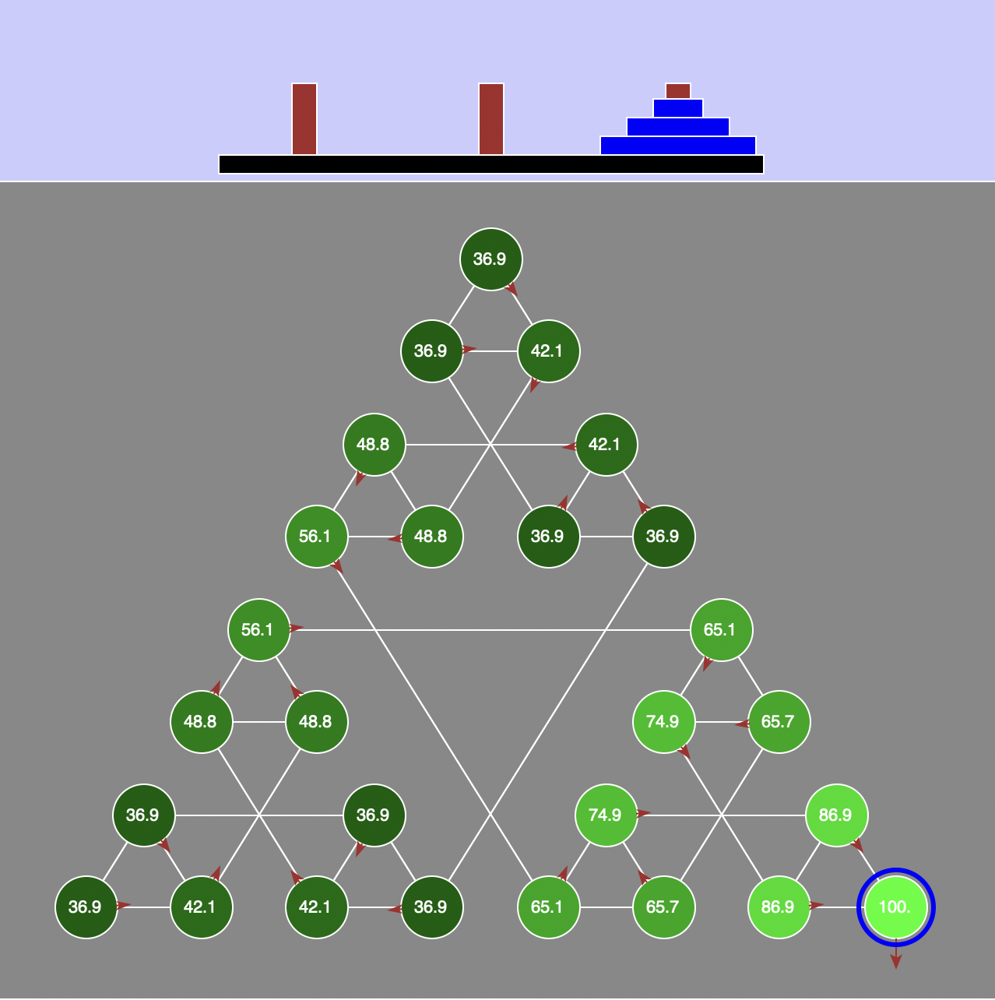

# Towers of Hanoi Value-Iteration and Q-Learning Solver

A personal project exploring reinforcement learning techniques, specifically Value Iteration and Q-Learning, applied to a Markov Decision Process (MDP) in the context of solving the Towers of Hanoi (TOH) puzzle. This project demonstrates how an agent can learn optimal policies through both model-based planning (Value Iteration) and model-free learning (Q-Learning) in a simulated environment.

## Overview

The project simulates a Towers of Hanoi problem, where an agent attempts to move disks from one peg to another following specific rules. The goal is to reach the final solved state with minimal moves, where the reward system encourages efficient solutions.

Using reinforcement learning, the agent learns the optimal policy for solving the TOH puzzle, using:
- **Value Iteration**: A method where the agent has full knowledge of the transition dynamics and reward structure.
- **Q-Learning**: A model-free approach where the agent discovers the optimal policy through exploration and experience.

## Project Structure

The following key files are part of this project:

- **solver_utils.py**: Contains utility functions for Value Iteration and Q-Learning implementations.
- **p3_report.py**: A template for analysis and observations on the agent’s performance.
- **solvers.py**: Provides classes and functions that handle the MDP setup for the Towers of Hanoi environment.
- **toh_mdp.py**: Defines the MDP structure, including states, actions, and rewards.
- **gui.py**: A GUI to visualize the TOH puzzle and the agent’s progress as it learns.
- **test_cases/**: A collection of test cases to verify implementation correctness.
- **test_runner.py**: Automated testing for the various components and methods.

## Features

- **Value Iteration Implementation**: The agent calculates the expected utility of each state using Bellman equations to iteratively find the optimal policy.
- **Q-Learning Implementation**: The agent learns through trial and error, employing an epsilon-greedy strategy to balance exploration and exploitation.
- **Custom Exploration Strategy**: Allows for dynamic epsilon adjustment based on step count, which enhances learning efficiency over time.
- **GUI Visualization**: See the agent’s progress and policy updates in real-time using a graphical interface.

# How It Works

## Value Iteration
Value Iteration is used when the transition model and reward function are known. The agent computes the utility for each state based on expected rewards, iterating until convergence to find an optimal policy.

## Q-Learning
Q-Learning is employed when the agent doesn’t know the transition dynamics. Using an epsilon-greedy policy, the agent explores various actions and updates Q-values based on observed rewards. This approach enables the agent to learn the optimal policy purely from experience.

## Custom Exploration
To ensure a balanced exploration, the agent’s epsilon parameter decreases as it progresses, focusing more on exploitation as it learns the optimal policy.

# Results and Observations
After running the simulations, the agent successfully learns the optimal policy for the Towers of Hanoi puzzle, demonstrating effective convergence with both Value Iteration and Q-Learning. The dynamic exploration strategy further enhances the efficiency, reducing unnecessary exploration in later stages.

# Future Enhancements
Implement additional exploration strategies, such as Upper Confidence Bound (UCB).
Extend the project to larger MDPs to test the scalability of the algorithms.
Integrate more complex reward structures to study the impact on learning behavior.

# Acknowledgments
This project was inspired by assignments from the University of Washington and UC Berkeley, which provided the foundation for exploring reinforcement learning concepts through the classic Towers of Hanoi puzzle.
